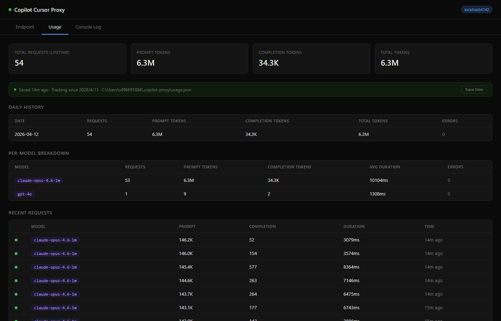
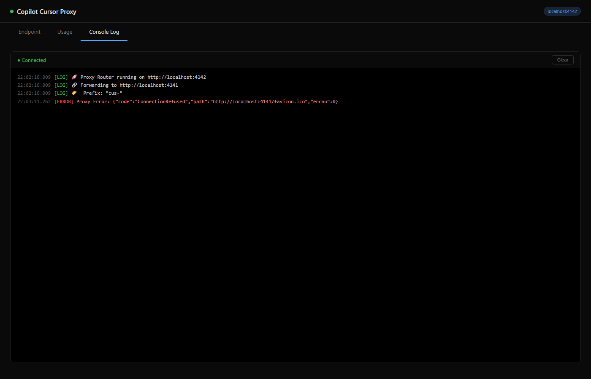

# 🚀 Copilot Proxy for Cursor

> Forked from [jacksonkasi1/copilot-for-cursor](https://github.com/jacksonkasi1/copilot-for-cursor) with full Anthropic → OpenAI conversion + Responses API bridge.

**Unlock the full power of GitHub Copilot in Cursor IDE.**

Use **all** Copilot models (GPT-5.4, Claude Opus 4.8, Claude Fable 5, Gemini 3.1, etc.) in Cursor — including Plan mode, Agent mode, and tool calls.

---

## ⚡ Quick Start

### One Command (npm)

```bash
npx copilot-for-cursor
```

> Requires [Bun](https://bun.sh/) installed. First run will prompt GitHub authentication.

This starts both `copilot-api` (port 4141) and the proxy (port 4142) in a single terminal.

### Or from source

```bash
git clone https://github.com/CharlesYWL/copilot-for-cursor.git
cd copilot-for-cursor
bun run start.ts
```

### Enable Max Mode (auto-compact long conversations)

```bash
bun run start.ts --max
```

> **Max mode** automatically compacts conversation history when the estimated token count exceeds 80% of the model's input token limit. It summarizes older messages into a structured summary while keeping the most recent messages intact — letting you have much longer coding sessions without hitting token limits.

> **🛡️ Always-on safety net:** Even without `--max`, the proxy now auto-compacts at **95%** of the model's input limit and falls back to hard truncation of the oldest messages if summarization fails. This prevents Cursor from ever hitting upstream `context_length_exceeded` errors. Use `--max` if you want proactive (80%) compaction for smoother long sessions.

### Then configure Cursor

Cursor requires HTTPS. This project uses a **fixed Cloudflare tunnel** at:

**`https://copilot-for-cursor.samstark.me/v1`**

The tunnel runs as a separate system service on your machine and forwards to port 4142. You do **not** need ngrok or a quick Cloudflare tunnel from the dashboard.

On startup, `start.ts` automatically writes the public URL into Cursor's settings (macOS). You can also click **Apply to Cursor** on the dashboard Tunnel tab.

### Auto-start at login (macOS)

```bash
./scripts/install-launch-agent.sh
```

This installs a LaunchAgent that runs `bun run start.ts --configure-cursor` from this repo at login.

**Service Management:**

```bash
# Check status
./scripts/service-status.sh

# Restart service (use this after updating code!)
./scripts/restart-service.sh

# View logs
tail -f ~/.local/share/copilot-for-cursor/launch.stdout.log

# Uninstall
./scripts/uninstall-launch-agent.sh
```

**⚠️ Important:** After pulling updates or editing code, **restart the service**:
```bash
./scripts/restart-service.sh
```

See [SERVICE-MANAGEMENT.md](./SERVICE-MANAGEMENT.md) for complete guide.

**When to restart:**
- After pulling new code (`git pull`)
- After editing any `.ts` files
- After installing dependencies
- If dashboard features aren't working

Logs: `~/.local/share/copilot-for-cursor/`
Config: `~/.copilot-proxy/config.json`

---

## 🏗 Architecture

```text
Cursor → (Cloudflare tunnel) → proxy-router (:4142)
                                  ├─ cus-*  → copilot-api (:4141) → GitHub Copilot
                                  └─ no prefix → personal OpenAI-compatible API
```

*   **Port 4141 (`copilot-api`):** Authenticates with GitHub, provides the OpenAI-compatible API, and natively handles the Responses API for GPT-5.x models.
    *   *Powered by [@jeffreycao/copilot-api](https://github.com/caozhiyuan/copilot-api) (installed via `npx`).*
*   **Port 4142 (`proxy-router`):** Converts Anthropic-format messages to OpenAI format, bridges Responses API for GPT-5.x models, handles the `cus-` prefix, and serves the dashboard.
*   **Cloudflare tunnel:** Runs as a system service — forwards `https://copilot-for-cursor.samstark.me` to localhost:4142.

### Proxy Router Modules

| File | Responsibility |
|---|---|
| `proxy-router.ts` | Entrypoint — Bun.serve, routing, CORS, dashboard, model list |
| `model-routing.ts` | `cus-` prefix, Copilot vs personal routing, Responses API detection |
| `personal-upstream.ts` | Personal OpenAI-compatible upstream for unprefixed models |
| `anthropic-transforms.ts` | Anthropic → OpenAI normalization (fields, tools, messages) |
| `responses-bridge.ts` | Chat Completions → Responses API bridge for GPT-5.x / goldeneye |
| `responses-converters.ts` | Responses API → Chat Completions format (sync & streaming SSE) |
| `stream-proxy.ts` | Streaming passthrough with chunk logging and error detection |
| `debug-logger.ts` | Request/response debug logging helpers |
| `start.ts` | One-command launcher for copilot-api + proxy-router |
| `max-mode.ts` | Auto-compaction for long conversations (`--max` flag) |
| `usage-db.ts` | Persistent request/token usage tracking |
| `auth-config.ts` | API key generation, validation, and config persistence |
| `upstream-auth.ts` | Upstream copilot-api authentication and key management |
| `public-config.ts` | Public URL from env / `~/.copilot-proxy/config.json` |
| `cursor-settings.ts` | Writes Cursor OpenAI base URL override (macOS) |
| `tunnel.ts` | Static public endpoint info for dashboard |
| `scripts/install-launch-agent.sh` | macOS auto-start at login |

---

## ⚙️ Cursor Configuration

1.  Go to **Settings** (Gear Icon) → **Models**.
2.  Add a new **OpenAI Compatible** model:
    *   **Base URL:** `https://copilot-for-cursor.samstark.me/v1`
    *   **API Key:** `dummy` (any value works)
    *   **Model Name:** Use a **prefixed name** — e.g., `cus-gpt-5.4`, `cus-claude-opus-4.6`

> **Switching work vs personal:** Keep the custom endpoint always on. Models with the `cus-` prefix go to GitHub Copilot (work). Models **without** the prefix go to your personal OpenAI-compatible upstream. See [Prefix routing](#prefix-routing).

> **💡 Tip:** Visit the [Dashboard](http://localhost:4142) to see all available models and copy their IDs.

### Prefix routing (Copilot vs personal)

Cursor's "Override OpenAI Base URL" is global — while it is on, **every** model hits this proxy, including built-in Cursor models. The proxy therefore routes by name:

| Model name | Where it goes | Token |
|---|---|---|
| `cus-gpt-5.4`, `cus-claude-sonnet-4.6`, … | Copilot (`localhost:4141`) | Work GitHub Copilot token |
| `gpt-5.4`, `claude-sonnet-4.6`, … (no `cus-`) | Personal upstream | `CURSOR_UPSTREAM_KEY` |

Set these env vars (or the same keys in `~/.copilot-proxy/config.json`) and restart the proxy:

```bash
export CURSOR_UPSTREAM_URL=https://api.openai.com/v1   # OpenAI-compatible base URL
export CURSOR_UPSTREAM_KEY=sk-...                      # personal API key
# optional, if the personal /models list is empty or incomplete:
export CURSOR_UPSTREAM_MODELS=gpt-5.4,claude-sonnet-4.6
```

Config file equivalent:

```json
{
  "cursorUpstreamUrl": "https://api.openai.com/v1",
  "cursorUpstreamKey": "sk-..."
}
```

Cursor does **not** expose a public chat-completions API for your Cursor subscription. Unprefixed traffic cannot be sent to Cursor's private backend. Point `CURSOR_UPSTREAM_URL` at a personal OpenAI-compatible provider (OpenAI, Azure, etc.) and keep Copilot for `cus-*`. Leave the env vars unset and unprefixed models keep going to Copilot (previous behavior).

Then in Cursor:

1. Leave **Override OpenAI Base URL** enabled (always).
2. Pick `cus-…` for work / Copilot.
3. Pick an unprefixed model for personal.

### Tested Models (20/21 passing)

| Cursor Model Name | Actual Model | Status |
|---|---|---|
| `cus-gpt-4o` | GPT-4o | ✅ |
| `cus-gpt-4.1` | GPT-4.1 | ✅ |
| `cus-gpt-41-copilot` | GPT-4.1 Copilot | ❌ Not supported by GitHub |
| `cus-gpt-5-mini` | GPT-5 Mini | ✅ |
| `cus-gpt-5.1` | GPT-5.1 | ✅ (deprecating 2026-04-15) |
| `cus-gpt-5.2` | GPT-5.2 | ✅ |
| `cus-gpt-5.2-codex` | GPT-5.2 Codex | ✅ |
| `cus-gpt-5.3-codex` | GPT-5.3 Codex | ✅ |
| `cus-gpt-5.4` | GPT-5.4 | ✅ |
| `cus-gpt-5.4-mini` | GPT-5.4 Mini | ✅ |
| `cus-claude-haiku-4.5` | Claude Haiku 4.5 | ✅ |
| `cus-claude-sonnet-4` | Claude Sonnet 4 | ✅ |
| `cus-claude-sonnet-4.5` | Claude Sonnet 4.5 | ✅ |
| `cus-claude-sonnet-4.6` | Claude Sonnet 4.6 | ✅ |
| `cus-claude-opus-4.5` | Claude Opus 4.5 | ✅ |
| `cus-claude-opus-4.6` | Claude Opus 4.6 | ✅ |
| `cus-claude-fable-5` | Claude Fable 5 | ✅ |
| `cus-gemini-2.5-pro` | Gemini 2.5 Pro | ✅ |
| `cus-gemini-3-flash-preview` | Gemini 3 Flash | ✅ |
| `cus-gemini-3.1-pro-preview` | Gemini 3.1 Pro | ✅ |
| `cus-text-embedding-3-small` | Text Embedding 3 Small | N/A (embedding model) |

> All GPT-5.x models now work thanks to the switch to [@jeffreycao/copilot-api](https://github.com/caozhiyuan/copilot-api), which natively supports the Responses API. The proxy also includes its own Responses API bridge as a fallback.


---

## ✨ Features

### Enhanced Capabilities (New!)

- **💰 Cost Tracking:** Real-time cost estimation based on model pricing, with budget alerts and spending breakdowns
- **🔄 Automatic Retries:** Exponential backoff for failed requests (429, 500, 502, 503, 504 errors)
- **🎯 Smart Model Router:** Automatically route requests to optimal models based on complexity and cost (optional)
- **🐳 Docker Support:** Run in containers with full Docker Compose configuration
- **📊 Enhanced Dashboard:** Cost analytics, budget alerts, and comprehensive usage statistics

### What the proxy handles

| Cursor sends (Anthropic format) | Proxy converts to (OpenAI format) |
|---|---|
| `system` as top-level field | System message |
| `tool_use` blocks in assistant messages | `tool_calls` array |
| `tool_result` blocks in user messages | `tool` role messages |
| `input_schema` on tools | `parameters` (cleaned) |
| `tool_choice` objects (`auto`/`any`/`tool`) | OpenAI format (`auto`/`required`/function) |
| `stop_sequences` | `stop` |
| `thinking` / `cache_control` blocks | Stripped |
| `metadata` / `anthropic_version` | Stripped |
| Images in Claude requests | `[Image Omitted]` placeholder |
| GPT-5.x `max_tokens` | Converted to `max_completion_tokens` |
| GPT-5.x Responses API | **Bridge built in** (needs `copilot-api` support) |

### Supported Workflows

*   **💬 Chat & Reasoning:** Full conversation context with all models
*   **📋 Plan Mode:** Works with tool calls and multi-turn conversations
*   **🤖 Agent Mode:** File editing, terminal, search, MCP tools
*   **📂 File System:** `Read`, `Write`, `StrReplace`, `Delete`
*   **💻 Terminal:** `Shell` (run commands)
*   **🔍 Search:** `Grep`, `Glob`, `SemanticSearch`
*   **🔌 MCP Tools:** External tools (Neon, Playwright, etc.)
*   **🗜️ Max Mode:** Auto-compact long conversations to stay within token limits (`--max`)
*   **💰 Cost Tracking:** Real-time cost estimation with per-model breakdowns
*   **🔄 Auto-Retry:** Exponential backoff for transient failures
*   **🎯 Smart Routing:** Complexity-based model selection (optional)

---

## 🔒 Security

### Dashboard Password Protection

**The dashboard is now password-protected!** On your first visit, you'll be prompted to set a password. This protects:
- Usage statistics and cost data
- API key management
- Console logs
- Configuration settings

**Features:**
- SHA-256 hashed passwords (never stored in plain text)
- Session-based authentication
- Logout button in header
- Easy password reset via browser console

See [PASSWORD-PROTECTION.md](./PASSWORD-PROTECTION.md) for complete guide including setup, reset, and troubleshooting.

### API Key Management

Manage API keys directly from the **Endpoint** tab in the dashboard:

1. Toggle **"Require API Key"** to enable authentication
2. Click **"+ Create Key"** to generate a new `cpk-xxx` key
3. Copy the key (shown only once!) and paste it into Cursor's **API Key** field
4. Enable/disable or delete keys as needed

When enabled, all `/v1/*` requests must include `Authorization: Bearer <your-key>`.


| Usage Tab | Console Log Tab |
|---|---|
|  |  |

---

## 📊 Dashboard

Access the dashboard at **[http://localhost:4142](http://localhost:4142)**

Four tabs:
- **Endpoint** — Proxy URL, API key management, model list
- **Usage** — Request stats, token counts, **cost tracking**, per-model breakdown, recent requests
- **Tunnel** — Public tunnel configuration and status
- **Console Log** — Real-time proxy logs with color-coded levels

### New Features

**Cost Tracking:**
- Estimated costs per request, model, and day
- Lifetime spending totals
- Budget alerts (configure via API)

**Enhanced Analytics:**
- Per-model cost breakdowns
- Daily spending history
- Token usage trends

---

## 🐳 Docker Deployment

Run the proxy in Docker for production deployments:

```bash
# Using Docker Compose (recommended)
docker-compose up -d

# Or build and run manually
docker build -t copilot-for-cursor .
docker run -d -p 4142:4142 copilot-for-cursor
```

See [DOCKER.md](./DOCKER.md) for complete deployment guide.

---

## 📱 Mobile Access (iPhone/iPad)

Access your proxy from any mobile device via the Cloudflare tunnel:

**Endpoint:** `https://copilot-for-cursor.samstark.me/v1`

Works with:
- OpenAI-compatible iOS apps (OpenCat, ChatGPT alternatives)
- Siri Shortcuts for voice AI
- Mobile browsers for dashboard access

See [MOBILE.md](./MOBILE.md) for complete mobile setup guide including:
- iOS Shortcuts examples
- Recommended apps
- Security best practices
- Troubleshooting

---

## ⚙️ Advanced Configuration

### Cost Tracking & Budget Limits

Set budget limits via the API:

```bash
# Set daily budget of $10
curl -X PUT http://localhost:4142/api/settings/budget \
  -H 'Content-Type: application/json' \
  -d '{"dailyLimit": 10}'
```

When limits are exceeded, requests return `429 Budget Exceeded`.

### Smart Model Routing

Enable intelligent model selection based on prompt complexity:

```bash
# Enable cost-optimized routing
curl -X PUT http://localhost:4142/api/settings/routing \
  -H 'Content-Type: application/json' \
  -d '{"enabled": true, "preferCost": true, "maxCostPerRequest": 0.05}'
```

The router automatically:
- Routes simple queries to faster/cheaper models
- Routes coding tasks to Codex models
- Routes complex reasoning to premium models
- Enforces per-request cost limits

### Retry Configuration

Customize retry behavior in `retry-logic.ts`:

```typescript
setRetryConfig({
    maxRetries: 3,
    initialDelayMs: 1000,
    maxDelayMs: 10000,
    retryableStatusCodes: [408, 429, 500, 502, 503, 504],
});
```

---

## ⚠️ Known Limitations

| Feature | Status |
|---|---|
| Basic chat & tool calling | ✅ Works |
| Streaming | ✅ Works |
| Plan mode | ✅ Works |
| Agent mode | ✅ Works |
| All GPT-5.x models | ✅ Works |
| Max mode (long session compaction) | ✅ Works (`--max` flag) |
| Extended thinking (chain-of-thought) | ❌ Stripped |
| Prompt caching (`cache_control`) | ❌ Stripped |
| Claude Vision | ❌ Not supported via Copilot |
| Public URL override | Set `PUBLIC_URL` env or `~/.copilot-proxy/config.json` |

---

## 📝 Troubleshooting

**"Model name is not valid" in Cursor:**
For Copilot, use the `cus-` prefix (e.g., `cus-gpt-5.4`). Unprefixed names are only valid after you set `CURSOR_UPSTREAM_URL` + `CURSOR_UPSTREAM_KEY`.

**Plan mode response cuts off:**
Ensure `idleTimeout: 255` is set in `proxy-router.ts` (already configured). Slow models like Opus need longer timeouts.

**GPT-5.x returns "use /v1/responses":**
The proxy auto-routes these. Make sure you're running the latest version.

**"connection refused":**
Ensure services are running: `bun run start.ts` or check `http://localhost:4142`.

**Max mode not compacting:**
Compaction only triggers when estimated tokens exceed 80% of the model's limit and there are at least 15 messages. Check the console log for `🗜️ Max mode` messages.

---

> ⚠️ **DISCLAIMER:** This project is **unofficial** and for **educational purposes only**. It interacts with undocumented internal APIs of GitHub Copilot and Cursor. Use at your own risk. The authors are not affiliated with GitHub, Microsoft, or Anysphere (Cursor). Please use your API credits responsibly and in accordance with the provider's Terms of Service.